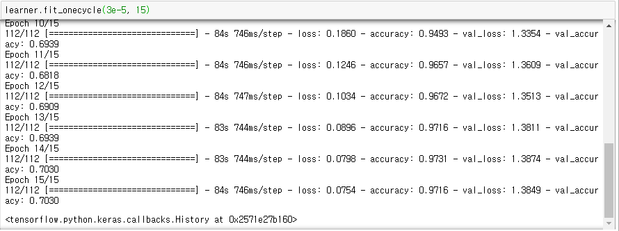

# Text Classification [🇰🇷](ko.md)

Detailed descriptions can be found at [Blog](https://hipgyung.tistory.com/93)

## Install Package
``` python
pip install requirements.txt
```

## How to use
With simple commands, you can proceed with text classification for datasets made up of csv files.
### General case
```
python main.py --csv data.csv --label Category --data Resume --epoch 5
```
### My case
```
python main.py --csv data.csv --label label_name --data data_name --epoch 5
```

## Available models
- BERT: *bert-base-uncased, bert-large-uncased, bert-base-multilingual-uncased, and others.*
- DistilBERT: *distilbert-base-uncased, distilbert-base-multilingual-cased, distilbert-base-german-cased, and others*
- ALBERT: *albert-base-v2, albert-large-v2, and others*
- RoBERTa: *roberta-base, roberta-large, roberta-large-mnli*
- XLM: *xlm-mlm-xnli15–1024, xlm-mlm-100–1280, and others*
- XLNet: *xlnet-base-cased, xlnet-large-cased*

Replace the bottom part with the model you want.
``` python
	MODEL_NAME = 'albert-base-v2'
```

## Outstanding performance
  
97%

## predictor
You can use the function below.
``` python
def predictor(learner, test):
	predictor = ktrain.get_predictor(learner.model, preproc=t)
	print(predictor.predict(test))

```

## tensorboard

```
tensorboard --logdir==training:your_log_dir --host=127.0.0.1
```

### Example
```
tensorboard --logdir==training:logs/ --host=127.0.0.1
```

## Library
> https://github.com/amaiya/ktrain